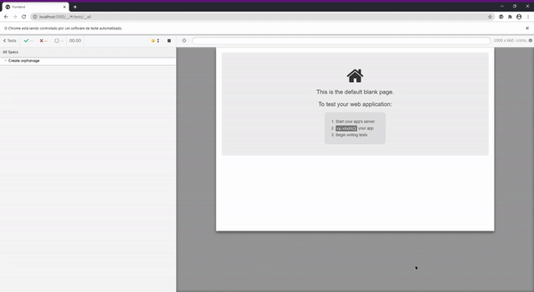

<p align="center">
  
</p>

<p align="center">
 
  <a href="https://www.linkedin.com/in/rebeca-ferreira-oliveira/">
    
  </a>
    
    
</p>

## :pushpin: Table of Contents

<!--ts-->
   * [About](#about)
   * [Technologies](#computer-technologies)
   * [Installation](#arrow_double_down-installation)
   * [How to Run](#arrow_forward-how-to-run)
   * [Automated Tests](#robot-automated-tests)
      * [Run tests]()
      * [Generate reports]()
<!--te-->

 ## About

This project was made during **Next Level Week** event, held by **Rocketseat**. 

**Happy** is a web application to find and visit orphanages nearby to make a child's day very **happy**!

#### Landing Page


#### Map Page


#### Details Page


#### Create new orphanage Page


 ## :computer: Technologies 
 
 This project was made using the following techologies:
 
- HTML5 
- CSS3 
- React 
- Node 
- TypeScript 
- Cypress 

## :arrow_double_down: Installation 

Clone repository:
```bash
$ git clone https://github.com/rebecaferreira/happy.git
```

Install dependencies:
```bash
# Go to backend folder
$ cd backend

# Install dependencies
$ yarn install

# Go to frontend folder
$ cd frontend

# Install dependencies
$ yarn install
```
## :arrow_forward: How to Run

Run server and client: 
```bash
# Go to backend folder
$ cd backend

# Run server
$ yarn dev

# Go to frontend folder
$ cd frontend

# Run client
$ yarn start
```
Access application on http://localhost:3000/ 

## :robot: Automated Tests
The test automation framework used in this project was **Cypress** 

Cypress is a JavaScript end to end testing framework, and is most often compared to Selenium; however Cypress is both fundamentally and architecturally different. Cypress is not constrained by the same restrictions as Selenium.
This enables you to write faster, easier and more reliable tests.

After you started the application, you can run the automated tests!

```bash
# Go to frontend folder
$ cd frontend

# Open Cypress
$ yarn cy:open
```
### Run Tests :fast_forward:

You can run your tests by using the Cypress test runner, or in headless mode.

```bash
#Headless mode
$ yarn cy:run
```
#### GIF of tests being executed:



### Generate Reports :memo:

The report generator used in this project was **Mochawesome**. All reports go to a folder called *mochawesome-report* inside Cypress folder.

To generate a test report, you must run a test (or tests) first. Then:
```bash
#Merge all reports in one file (index.json)
$ yarn report:merge

#Generate report html
$ yarn report:mocha

#If you want to delete all reports, run:
$ yarn report:clean
```
